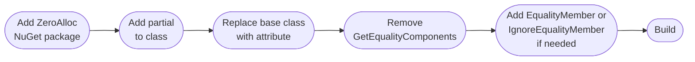

# Migration Guide

## From `CSharpFunctionalExtensions.ValueObject`

### Step-by-step



### Before

```csharp
using CSharpFunctionalExtensions;

public class Money : ValueObject
{
    public decimal Amount { get; }
    public string Currency { get; }

    public Money(decimal amount, string currency)
    {
        Amount = amount;
        Currency = currency;
    }

    protected override IEnumerable<IComparable> GetEqualityComponents()
    {
        yield return Amount;
        yield return Currency;
    }
}
```

### After

```csharp
using ZeroAlloc.ValueObjects;

[ValueObject]
public partial class Money        // 1. add partial
{                                 // 2. remove : ValueObject
    public decimal Amount { get; }
    public string Currency { get; }

    public Money(decimal amount, string currency)
    {
        Amount = amount;
        Currency = currency;
    }
                                  // 3. remove GetEqualityComponents()
}
```

### Handling partial equality

If `GetEqualityComponents()` previously returned fewer properties than the class has, map that to attributes:

```csharp
// Before — only Name was used for equality
public class Category : ValueObject
{
    public string Name { get; }
    public string Description { get; }  // not in GetEqualityComponents

    protected override IEnumerable<IComparable> GetEqualityComponents()
    {
        yield return Name;
    }
}

// After — use [EqualityMember] opt-in
[ValueObject]
public partial class Category
{
    [EqualityMember] public string Name { get; }
    public string Description { get; }  // excluded automatically
}

// Or use [IgnoreEqualityMember] opt-out
[ValueObject]
public partial class Category
{
    public string Name { get; }
    [IgnoreEqualityMember] public string Description { get; }
}
```

---

## From Manual Equality Implementation

### Before

```csharp
public class ProductCode : IEquatable<ProductCode>
{
    public string Value { get; }

    public ProductCode(string value) => Value = value;

    public override bool Equals(object? obj) =>
        obj is ProductCode other && Equals(other);

    public bool Equals(ProductCode? other) =>
        other is not null && Value == other.Value;

    public override int GetHashCode() =>
        HashCode.Combine(Value);

    public static bool operator ==(ProductCode? left, ProductCode? right) =>
        left is null ? right is null : left.Equals(right);

    public static bool operator !=(ProductCode? left, ProductCode? right) =>
        !(left == right);
}
```

### After

```csharp
using ZeroAlloc.ValueObjects;

[ValueObject]
public partial class ProductCode
{
    public string Value { get; }
    public ProductCode(string value) => Value = value;
    // Equality members removed — generated automatically with identical semantics
}
```

Delete the hand-written `Equals`, `GetHashCode`, `operator ==`, `operator !=`. The generator produces equivalent code.
