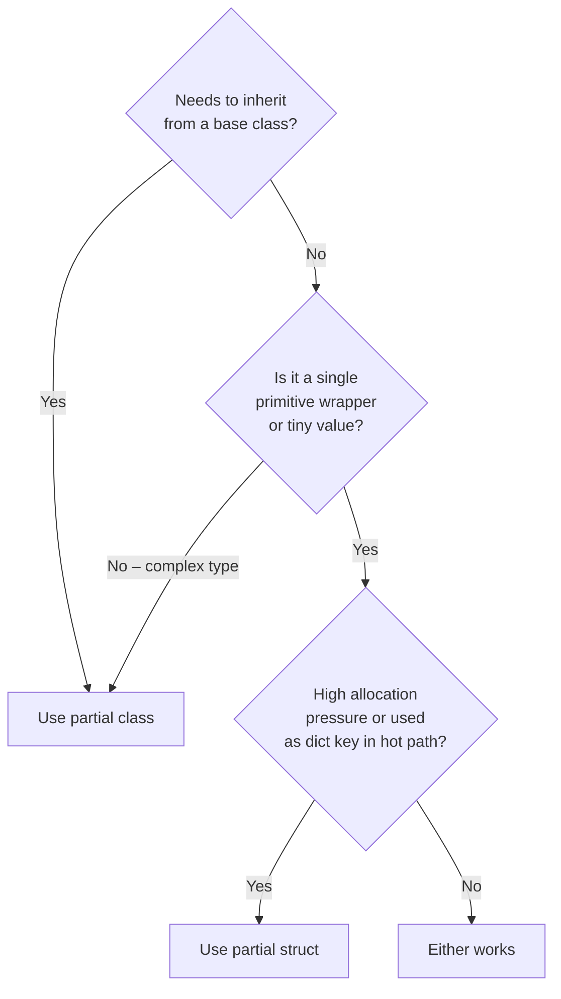

# Struct vs. Class

## Decision guide



## Use a `partial struct` when

- The type wraps a single primitive (id, amount, code, flag)
- Instances are short-lived or frequently created
- The value is used as a dictionary key in a hot path
- You want to avoid heap allocation for the value object itself

```csharp
[ValueObject]
public readonly partial struct OrderId
{
    public Guid Value { get; }
    public OrderId(Guid value) => Value = value;
}

[ValueObject]
public readonly partial struct Quantity
{
    public int Value { get; }
    public Quantity(int value) => Value = value;
}
```

Structs are stack-allocated (when not boxed) and incur no GC overhead.

## Use a `partial class` when

- The type has multiple properties or complex behaviour
- The type needs to inherit from a base class
- The type participates in polymorphism
- Reference equality is needed somewhere in the codebase

```csharp
[ValueObject]
public partial class Money
{
    public decimal Amount { get; }
    public string Currency { get; }
}

// Works even when inheriting from application infrastructure
[ValueObject]
public partial class DomainEvent : BaseEvent
{
    public Guid EventId { get; }
    public DateTime OccurredAt { get; }
}
```

## `ForceClass = true`

Occasionally a type must be declared as a `struct` for legacy reasons (e.g., JSON serialiser layout, P/Invoke interop) but needs class-style equality (reference-nullable `Equals(T?)`). Set `ForceClass = true`.

```csharp
// Struct declaration retained for interop reasons
[ValueObject(ForceClass = true)]
public partial struct LegacyEventId
{
    public long Value { get; }
}

// Generator emits:
sealed partial class LegacyEventId : System.IEquatable<LegacyEventId>
{
    public bool Equals(LegacyEventId? other) =>
        other is not null && Value == other.Value;
    // ...
}
```
