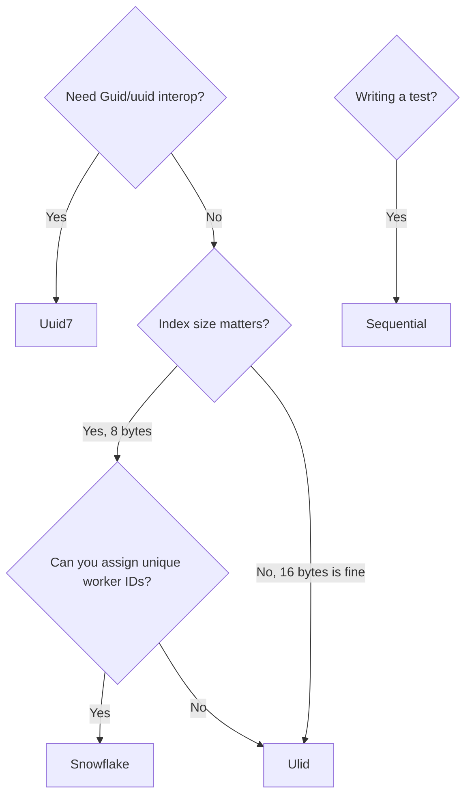

# Strategies

Four strategies ship in v1. Each targets a different deployment profile. Pick based on storage width, sortability, and how you generate IDs across processes.

## At a glance

| Strategy | Backing | Serialized form | Bits of entropy | Sortable | Cryptographic randomness | Production-safe |
|---|---|---|---|---|---|---|
| `Ulid` (default) | `Guid` (128-bit) | 26-char Crockford base32 | 80 | Lexicographic | Yes | Yes |
| `Uuid7` | `Guid` (128-bit) | 36-char hyphenated UUID | 74 (rand_a + rand_b) | Lexicographic | Yes | Yes |
| `Snowflake` | `Int64` (63-bit positive) | Decimal string | 0 (no randomness) | Numeric | No | Yes (with worker-ID config) |
| `Sequential` | `Int64` | Decimal string | 0 | Numeric | No | **No — tests only** |

## Resolution order

For any `[TypedId]` struct the generator picks `(Strategy, Backing)` in this order:

1. Per-struct `[TypedId(Strategy = ..., Backing = ...)]` wins when set.
2. Otherwise `[assembly: TypedIdDefault(...)]`.
3. Otherwise built-in default: `IdStrategy.Ulid` + `BackingType.Default`.

`BackingType.Default` auto-picks:

- `Ulid` / `Uuid7` → `BackingType.Guid`
- `Snowflake` / `Sequential` → `BackingType.Int64`

Incompatible combinations (`Snowflake + Guid`, `Ulid + Int64`) raise [ZATI001](diagnostics.md) at compile time.

---

## ULID (default)

ULIDs are 128-bit identifiers combining a 48-bit millisecond timestamp with 80 bits of randomness, encoded as 26 Crockford base32 characters. Monotonic within a millisecond: consecutive `New()` calls during the same tick strictly increase.

**Byte layout (big-endian):**

```
 0               48                                   128
 +----------------+-------------------------------------+
 |  timestamp_ms  |              randomness             |
 |     48 bits    |                80 bits              |
 +----------------+-------------------------------------+
```

**String form (26 chars, Crockford base32):**

```
 01ARZ3NDEK   TSV4RRFFQ69G5FAV
 ^^^^^^^^^^   ^^^^^^^^^^^^^^^^
 timestamp    randomness
```

```csharp
[TypedId(Strategy = IdStrategy.Ulid)]
public readonly partial record struct OrderId;

var a = OrderId.New();    // 01ARZ3NDEKTSV4RRFFQ69G5FAV
var b = OrderId.New();    // 01ARZ3NDEKTSV4RRFFQ69G5FAW  (monotonic tick)
bool ordered = a < b;     // true
```

Use for: general-purpose distributed IDs, event sourcing event IDs, API-exposed identifiers where you want short URLs and natural sort order.

---

## UUIDv7 (RFC 9562)

UUIDv7 stores a 48-bit unix-millisecond timestamp followed by the `version` nibble (`0111`), 12 bits of randomness (`rand_a`), the `variant` two bits (`10`), and 62 bits of randomness (`rand_b`). Interops with every library that understands `Guid` or `uuid`.

**Byte layout (big-endian, 128 bits):**

```
 0                    48   52           64 66                        128
 +--------------------+----+-------------+--+---------------------------+
 |   unix_ts_ms       |ver |   rand_a    |v |          rand_b           |
 |     48 bits        | 4  |    12       |2 |           62 bits         |
 +--------------------+----+-------------+--+---------------------------+
 ver = 0111 (7)   v = 10 (RFC 4122 variant)
```

**String form:**

```
 018fa3c9-1234-7abc-8def-0123456789ab
 \____________/ \__/ \______________/
    ts_ms       ver   variant+rand_b
```

```csharp
[TypedId(Strategy = IdStrategy.Uuid7)]
public readonly partial record struct UserId;

var id = UserId.New();
Console.WriteLine(id);   // "018fa3c9-1234-7abc-8def-0123456789ab"
```

Use for: scenarios where you need `uuid` column compatibility or interop with Guid-based tooling that expects the hyphenated form.

---

## Snowflake

Snowflake packs a 41-bit timestamp (milliseconds since `2020-01-01T00:00:00Z`), a 10-bit worker ID, and a 12-bit per-millisecond sequence into the low 63 bits of a signed `long`. The sign bit stays zero so the raw value is always positive and database-friendly.

**Bit layout (63 used bits in a signed long):**

```
 63        62                          22     12          0
 +--+--------------------------------+--------+------------+
 | 0|     timestamp_ms (41 bits)     |worker  | seq (12b)  |
 |  |     since 2020-01-01Z          | (10b)  |  0..4095   |
 +--+--------------------------------+--------+------------+
  sign bit always 0
```

Capacity: 41 bits of ms = ~69 years; 1024 workers; 4096 IDs per worker per ms.

```csharp
[TypedId(Strategy = IdStrategy.Snowflake)]
public readonly partial record struct MessageId;

var id = MessageId.New();
Console.WriteLine(id);        // "1748213984512000001"  (decimal long)
Console.WriteLine(id.Value);  // 1748213984512000001L
```

**Requires configuration.** Without a registered worker ID provider, the first `New()` call throws `TypedIdException` (see [Snowflake configuration](snowflake-config.md)).

**Trade-offs:** 8 bytes vs 16 for ULID/UUID7, smaller indexes, no cryptographic randomness (IDs are guessable), requires worker-ID coordination across processes.

Use for: high-volume distributed systems where 8-byte IDs matter — message queues, telemetry pipelines, hot-path event tables.

---

## Sequential

`Sequential` is an `Interlocked.Increment` on a static counter. The counter starts at zero on every process start and is not persisted.

```csharp
[TypedId(Strategy = IdStrategy.Sequential, Backing = BackingType.Int64)]
public readonly partial record struct TestStableId;

var a = TestStableId.New();   // 1
var b = TestStableId.New();   // 2
var c = TestStableId.New();   // 3
```

**Use for: tests only.** It's deterministic and collision-free within a single process, which is useful for snapshot tests and seed data. It is not production-safe:

- Two processes will mint the same IDs.
- Restarts reset to zero.
- No time ordering, no cross-process uniqueness guarantee.

See [Production checklist](production.md) for the full rationale.

---

## Comparison cheat-sheet



- Default choice: **ULID**. It works everywhere, sorts well, is short in URLs, and needs no configuration.
- Pick **UUIDv7** when you must interop with `uuid`/`Guid` tooling.
- Pick **Snowflake** when storage width dominates and you can assign stable worker IDs.
- Pick **Sequential** only inside test projects.
